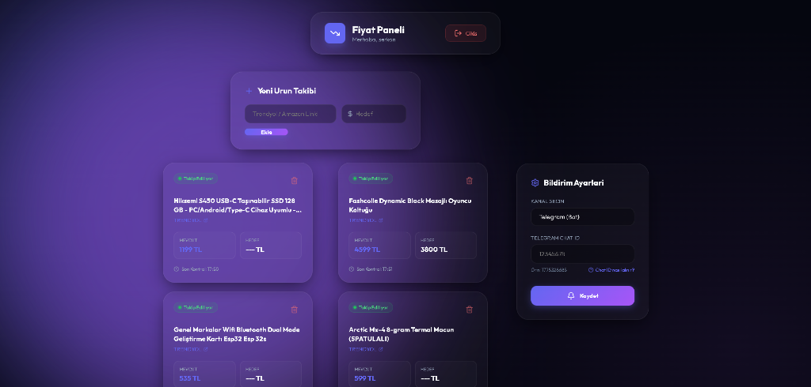
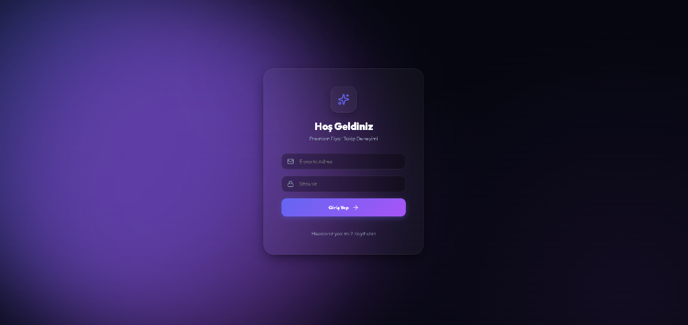

# Premium Price Tracker Bot 📉

A robust and scalable price tracking solution for popular e-commerce platforms (Trendyol, Hepsiburada, Amazon, N11, Itopya). This bot utilizes **Gemini AI (Flash)** for intelligent price extraction and provides real-time notifications via **Telegram**.

---

## 📷 Screenshots

### Dashboard


### Login Page


---

## 🚀 Features

- **AI-Powered Extraction**: Uses Google Gemini Flash to accurately find prices in complex HTML structures.
- **Multi-Platform Support**: Seamlessly track products across multiple marketplaces.
- **Instant Telegram Alerts**: Get notified the second a price drops.
- **Advanced Admin Dashboard**: A modern React-based glassmorphism dashboard for managing products, users, and settings.
- **Secure Architecture**: JWT-based authentication and secure Firestore database integration.

---

## 🔒 Security & Setup (IMPORTANT)

For security reasons, sensitive configuration files are **not** included in this repository. You must set them up manually before running the application.

### 1. Environment Variables (`.env`)
Create a `.env` file in the root directory. You can use `.env.example` as a template.

```env
GEMINI_API_KEY=your_google_gemini_api_key
TELEGRAM_BOT_TOKEN=your_telegram_bot_token
TELEGRAM_CHAT_ID=your_personal_chat_id
ADMIN_PASSWORD=your_secure_admin_password
JWT_SECRET=your_random_jwt_secret
PORT=3001
```

*   **Gemini API Key**: Obtain it from [Google AI Studio](https://aistudio.google.com/).
*   **Telegram Token**: Create a bot via [@BotFather](https://t.me/BotFather) on Telegram.
*   **Telegram Chat ID**: Use [@userinfobot](https://t.me/userinfobot) to find your numeric ID.

### 2. Firebase Configuration (`serviceAccountKey.json`)
This project uses Firebase Firestore.
1.  Go to the [Firebase Console](https://console.firebase.google.com/).
2.  Create a project and go to **Project Settings** > **Service accounts**.
3.  Click **Generate new private key** and download the JSON file.
4.  Rename it to `serviceAccountKey.json` and place it in the project root.

---

## 📦 Installation

### Prerequisites
- Node.js (v18 or higher)
- npm or yarn

### Steps

1.  **Clone the Repository**
    ```bash
    git clone https://github.com/Serkan-design/price-tracker-bot.git
    cd price-tracker-bot
    ```

2.  **Install Backend Dependencies**
    ```bash
    npm install
    ```

3.  **Install Frontend Dependencies**
    ```bash
    cd panel
    npm install
    cd ..
    ```

4.  **Build the Dashboard**
    ```bash
    cd panel
    npm run build
    cd ..
    ```

5.  **Run the Application**
    ```bash
    # For development
    node server.js

    # Using PM2 (Recommended for Production)
    pm2 start server.js --name price-tracker-bot
    ```

---

## 🛠️ Project Structure

- `/panel`: React-based Admin Dashboard.
- `/engine`: Core logic for scraping, analysis, and notifications.
- `/scrapers`: Platform-specific scraping scripts.
- `/tests`: Test scripts and debugging tools.
- `server.js`: Express API server and Cron Job manager.
- `ai.js`: Gemini AI integration logic.

## 💬 Information for Contributors
If you find any bugs or want to add a new platform, feel free to open a Pull Request. Experimental debug scripts are available in the `/tests` folder for testing new scrapers.

---

**Disclaimer**: This tool is for personal use and educational purposes. Ensure compliance with the Terms of Service of the platforms you are tracking.
